# Wagtail CRX Snipcart Template

This project integrates [Wagtail CRX](https://docs.coderedcorp.com/wagtail-crx/) and [Snipcart](https://snipcart.com/). My purpose for creating this is twofold. I realized that creating an e-commerce store in one of my favorite technology ecosystems took a lot of work, so I changed that. Secondly, I often have ideas, but they aren't worth anything unless you validate them. This template will help others out there validate their ideas quickly and affordably.

## Status

|                        |                      |
|------------------------|----------------------|
| Wagtail CRX         | 1.0 |
| Snipcart                  | 3.0 |

## What is Wagtail CRX Snipcart Template?

This project takes the best of both worlds. [Wagtail CRX](https://github.com/coderedcorp/coderedcms), an opinionated flavor of [Wagtail](https://github.com/wagtail/wagtail), expedites development time and keeps you from reinventing the wheel. At the same time, [Snipcart](https://snipcart.com/) offloads the overhead of designing and implementing a robust e-commerce solution, allowing you to quickly get a powerful e-commerce site up and running.

## Project Origins

This project began as [my capstone](https://github.com/justicepelteir/wagtail_crx_snipcart_storefront) for [Epicodus](https://www.epicodus.com/). The full-stack software developer bootcamp I attended. I had a client who wanted an e-commerce site built. Initially, I was going to make the website from scratch using my bootcamp's technology stack, Ruby On Rails, JS, and React, but I quickly decided against it.

I would be doing my client a disservice. I could leverage existing solutions that would equip the project with capabilities that would increase my client's chances of success. I began learning [Python 3](https://www.python.org/)  during the Pandemic and became familiar with [Django](https://github.com/django/django) before my bootcamp. I remembered dabbling with Wagtail CMS and another project called CodeRed CMS, which optimized for rapid development. A couple of google searches later, I discovered CodeRed CMS had rebranded to Wagtail CRX and developed significantly since I last saw it. It was exactly what I needed. Now I needed an e-commerce solution. 

Unfortunately, I could not locate an up-to-date open-source e-commerce solution I was confident implementing. I could create a homebrewed solution, but that would result in the same problem as before - I wouldn't be setting my client up for success. I knew a robust solution had to exist. After some more searching, I encountered Snipcart; the rest is history.

A couple of weeks after completing my bootcamp coursework, I got a very cool surprise while beginning the steps to transform my capstone into an open-source python package. While perusing the official Wagtail Documentation, I stopped by the third-party tutorials section. At the top of the third-party tutorial list was a "Guide to integrate Wagtail CRX with a Snipcart storefront (9 October 2022)." Thinking how uncanny the coincidence was after developing my solution, I clicked on it, curious to see what someone else had developed - only for the link to take me to my capstone repository. When doing a google search for "how to integrate wagtail crx with snipcart," my project repo and Wagtail's "Guide to integrate Wagtail CRX with a Snipcart storefront (9 October 2022)" were now the top results.

I originally planned to create a Python Package based on this project to give back to the community that got me into programming. Still, I did not imagine I would stumble across my project included in Wagtail's official documentation site. The original goal was to make creating a Wagtail-based e-commerce store as simple as spinning up a CRX project and pip-installing the package. However, I realized creating an open-source template serves the same purpose in fewer steps. Unless I encounter a drastic need to create a package, I may settle for improving this template over time and creating further documentation and guides to customize this template as per user needs.

## Why did I decide to integrate Wagtail CRX and Snipcart?
I decided to utilize the following three technologies because of the following reasons in no specific order:
- Well maintained
- Well documented
- Expedites development time
- Equips end users with advanced tools from inception

### Main Tech Stack Summaries
#### Wagtail CMS
> Wagtail is an open source content management system built on Django, with a strong community and commercial support. It's focused on user experience, and offers precise control for designers and developers.

#### Wagtail CRX
> CRX, formerly known as CodeRed CMS, provides a large set of enhancements and pre-built components for Wagtail which are ready to use out-of-the box! This saves development time and avoids "re-inventing the wheel" by providing features commonly needed by websites.

#### Snipcart
> It's simple, fully customizable, well documented, regularly maintained, updated, and includes a robust e-commerce dashboard.

---

## Quick start

##### Create a Wagtail CRX Template Project

###### Phase One

1. Select the green `Use this template` button at the top of this page.

2. Press either `Create a new repository` or `Open in a codespace`.
   - I am only demonstrating project set up for `Create a new repository`.

3. Enter your chosen repository name, and press `Create repository from template`.

4. You should now have your own remote project repostiory.

###### Phase Two

5. On your local machine, open your terminal, and navigate to your project directory.

6. Run `mkdir project-name` to make your project directory.

7. Run `cd project-name` to navigate into your new project directory.

8. Run `python -m venv venv` to create a virtual envrionment.
    - You may have to replace `python` with `python3` depending upon your python setup.
9. Run `source venv/bin/activate` to activate your new virtual environment.

10. Run `pip install coderedcms` to install Wagtail CRX.

###### Phase Three

11. Navigate to your GitHub project repository, press on the green button that says *Code*. Copy your pertinent GitHub repository link - HTTPS or SSH.

12. Run `git clone <GitHub Repository Link>`, replacing `<GitHub Repository Link>` with your copied link.
    - It should appear similar to the following two examples:
        - HTTPS: `git clone https://github.com/johndoe/project-name.git`
        - SSH: `git clone git@github.com:johndoe/project-name.git`

13. Run `cd <Cloned GitHub Repository Name>`

14. Run `python manage.py migrate` to create the core models.
    - Wagtail CRX, by default, utilizes SQLite. Set up your preferred database solution now to save yourself the headache of a database migration. 
        - If you choose PostgreSQL, feel free to leverage my [tutorial](https://www.justicedouglas.com/blog/creating-wagtail-crx-project-with-postgresql/).

15. Run `python manage.py createsuperuser` to create the initial admin user.

16. Run `python manage.py runserver` to launch the development server. 
   - To see the default project go to `http://localhost:8000` in your browser, or `http://localhost:8000/admin/` to log in with your admin account. 

###### Phase Four

17. Create a [Snipcart](https://snipcart.com/) account and get your **Public Test API Key**.

18. Navigate to `http://localhost:8000/admin/settings/website/snipcartsettings` and paste your **Public Test API Key** into the *Snipcart API Key* input field.
   - Once your e-commerce store is ready to go live and sell to customers, you will replace the **Public API Test Key** with the **Public Live API Key** provided by Snipcart.

###### Phase Five

19. Install [ngrok](https://ngrok.com/), and add *ngrok provided* authtoken.
   - [Official Snipcart ngrok Documentation](https://snipcart.com/blog/develop-a-snipcart-powered-website-locally-using-ngrok)
   - Snipcart cannot communicate with your local machine. Thus local development is impossible without making your local development server available to Snipcart. Ngrok solves this pain point.
   - If utilizing Mac OS, I suggest installing ngrok via the Homebrew option.

20. In a separate terminal run `ngrok http <localhost number>`.
   - Example: `ngrok http 8080`

21. If successful you will see a ngrok session status appear. Copy the *forwarding url*.
   - Example: `https://<string-of-random-numbers-and-letters>.ngrok.io`

22. Navigate to your Snipcart dashboard, open account options (click on the upper right-hand corner human icon), and click on *Domains & URLS*.

23. In the Domain field, paste the ngrok forwarding url. 

24. In the protocol field, select `https`

25. Press the save button on the *Domains & URLS* page. 
    - IMPORTANT NOTE: Everytime you need to create a new ngrok tunnel you must update this. Otherwise, you will experience a checkout error.

26. Paste your ngrok forwarding url into your search bar and hit enter. It should take you to your project in a tab with a ngrok tunnel capable of making transactions with Snipcart.
   - If the url activates a *Deceptive site ahead* page from Google Chrome, click on *details* and press *visit this unsafe site.*

27. In a separate tab, paste your local host url that is running the project - Example: `http://localhost:8000`
   - IMPORTANT NOTE: You must have two separate tabs open and use them in unison.
      - `https://<string-of-random-numbers-and-letters>.ngrok.io` --> Can make Snipcart transactions. Can't access the admin dashboard.
      - `http://localhost:8000` --> Can't make Snipcart transactions. Can access the admin dashboard.

###### Phase Six

28. In the **admin capable tab**, create a test product via signing into the admin and creating a *Products Landing Page*. After creation, navigate to your newly created *Products Landing Page* in the admin and click create *child page*. Fill out all required product information, and press *publish* when done.

29. In the **transaction capable tab**, add the product to your cart and attempt to check out.
    - You should now be able to perform transactions (only test transactions are covered in this guide), which are required to [populate your product data into your Snipcart accounts dashboard](https://docs.snipcart.com/v3/dashboard/store-management#5-products).

30. Congratulations, you have successfully made a test transaction and completed the tutorial! 🎉 
    - You will be able to see your transaction in your Snipcart dashboard. 
    - Delete README_media and replace any pre-existing items as you see fit.

---

#### Quick Start Disclaimer
1. It is your responsibility to manage your Snipcart-provided APIs properly.
2. It is your responsibility to read all pertinent documentation not covered here.
3. Upon completing the quickstart you should have a fully functional non-live project capable of making test transactions.
4. It is your responsibility to ensure you have chosen and correctly configured a database that scales proportionally to your ambitions. 
5. Before deploying your project to production, you are responsible for protecting sensitive data pertaining to your project, such as database environmental variables and other sensitive information.

## Documentation links

* To customize the content, design, and features of the site see
  [Wagtail CRX](https://docs.coderedcorp.com/wagtail-crx/).

* For deeper customization of backend code see
  [Wagtail](http://docs.wagtail.io/) and [Django](https://docs.djangoproject.com/).

* For Snipcart customizations and utilization, see [Snipcart](https://docs.snipcart.com/v3/).

* For HTML template design see [Bootstrap](https://getbootstrap.com/).

---

## Example Project Screenshots
##### Disclaimer
Due to the passionately long nature of the example customer's email, the email text runs into the billing address text in screenshots seven and eight. Under normal email length circumstances provided by test users, not hellbent on [pressuring Tacobell to bring back the XXL Grilled Stuft Burrito](https://www.change.org/p/taco-bell-bring-back-the-xxl-grilled-stuffed-burrito), this text conflict would not occur.
1. 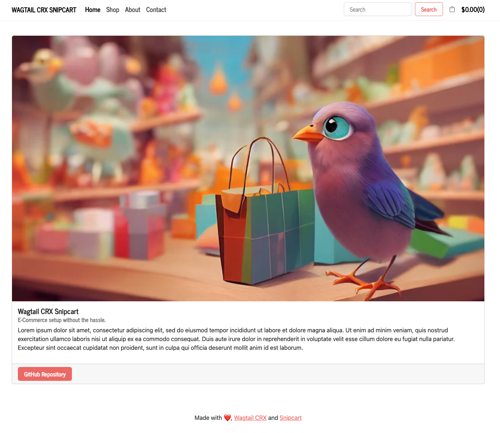
2. 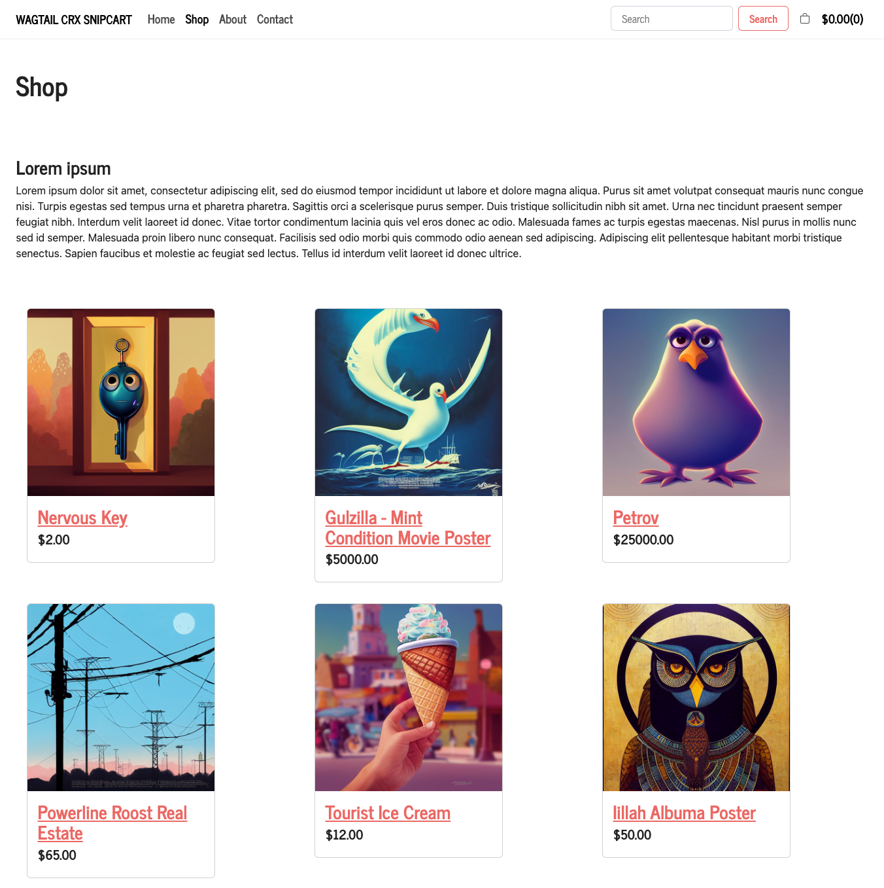
3. 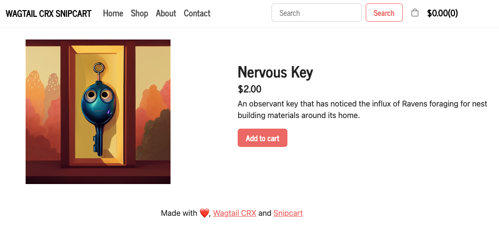
4. 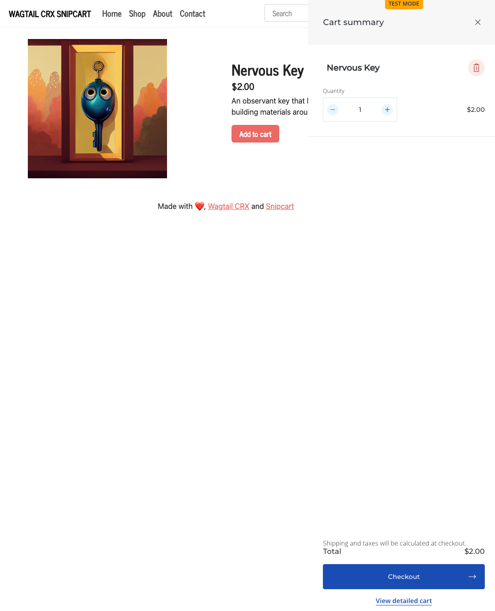
5. 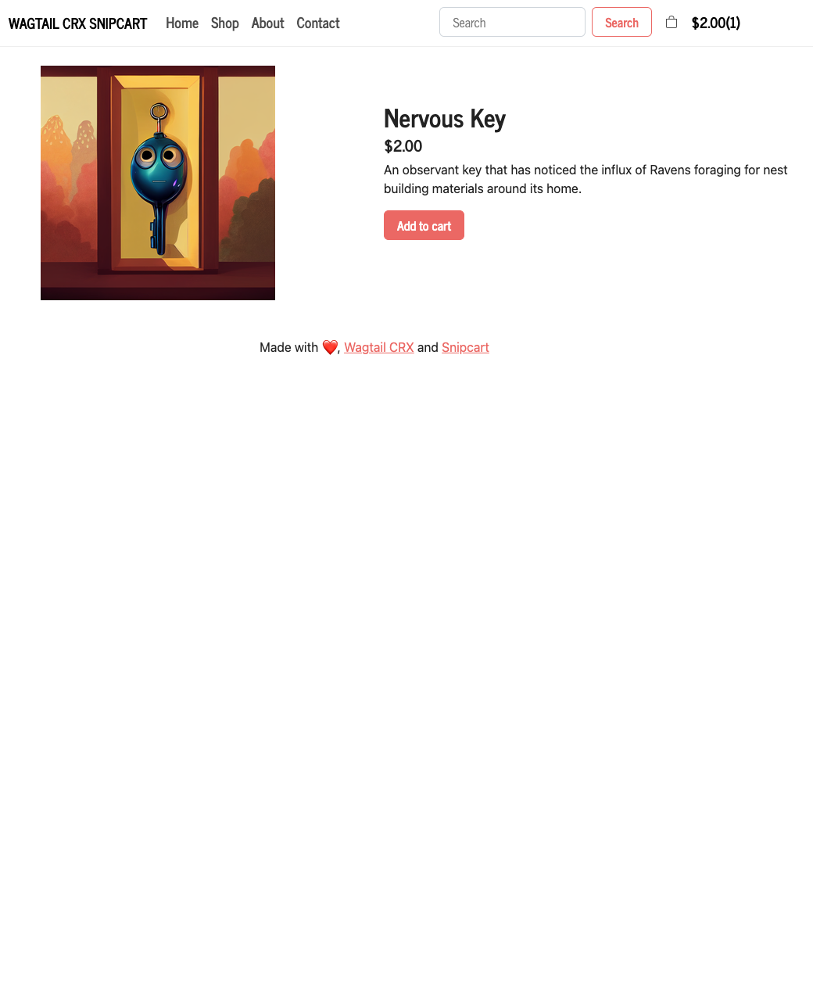
6. 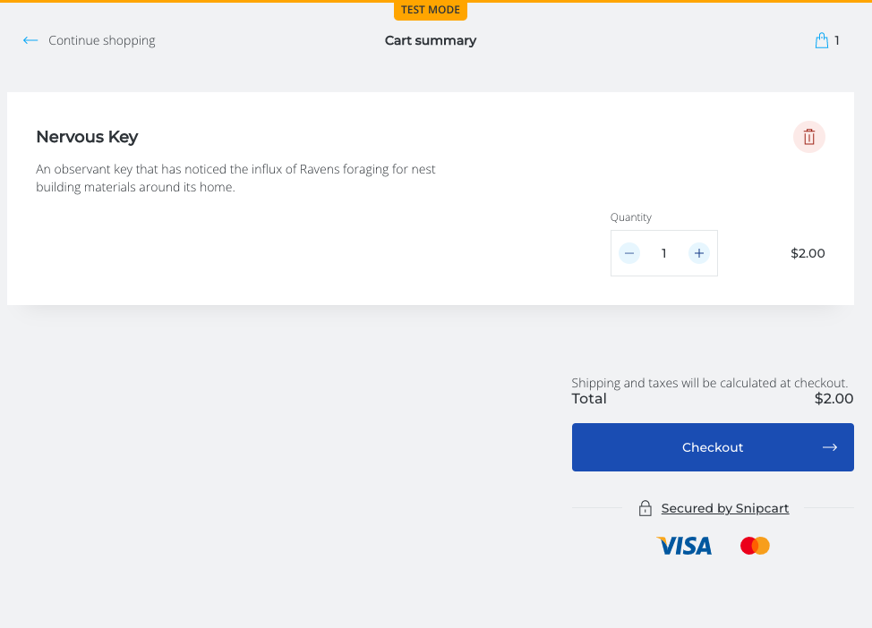
7. 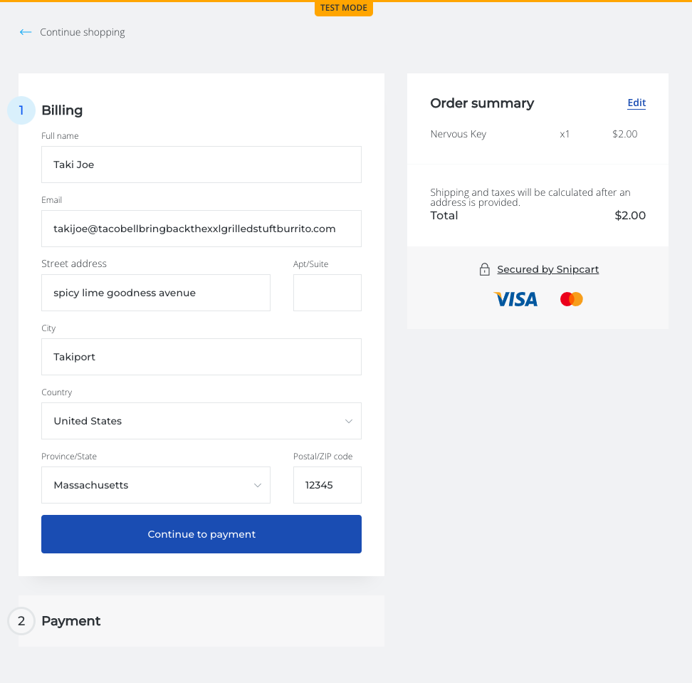
8. 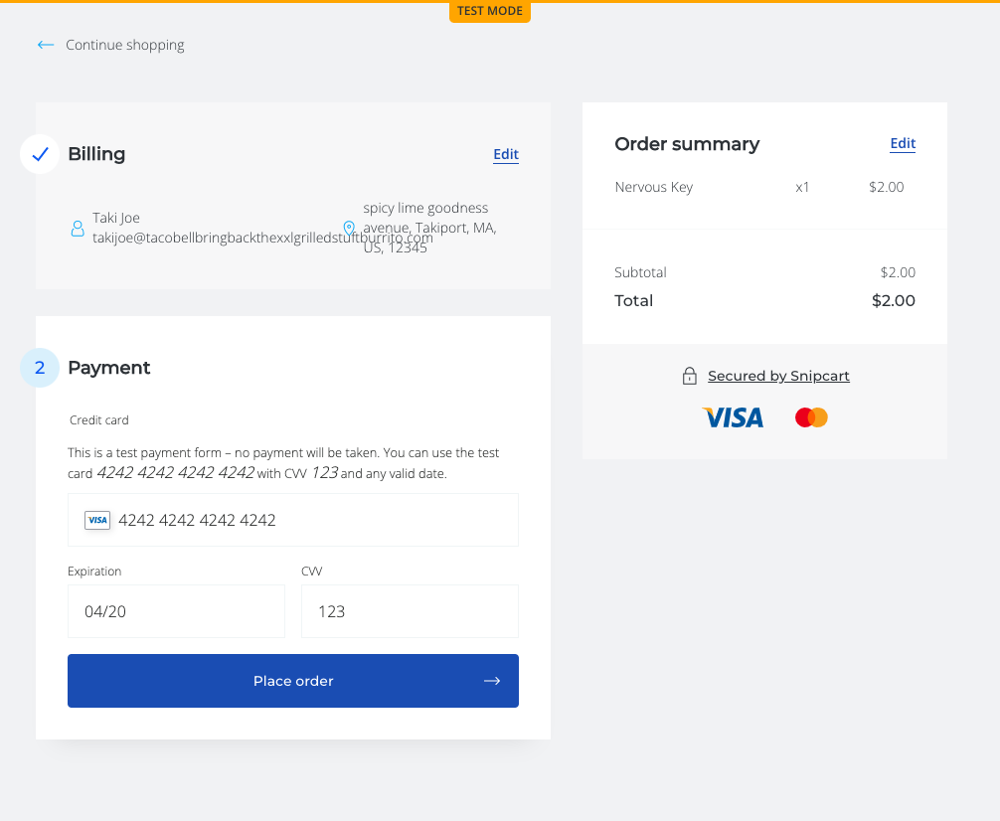
9. 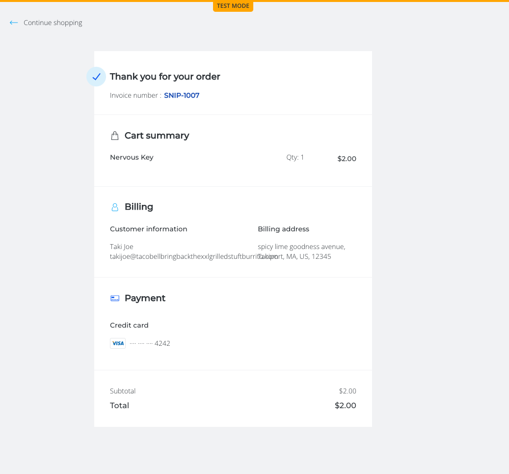
10. 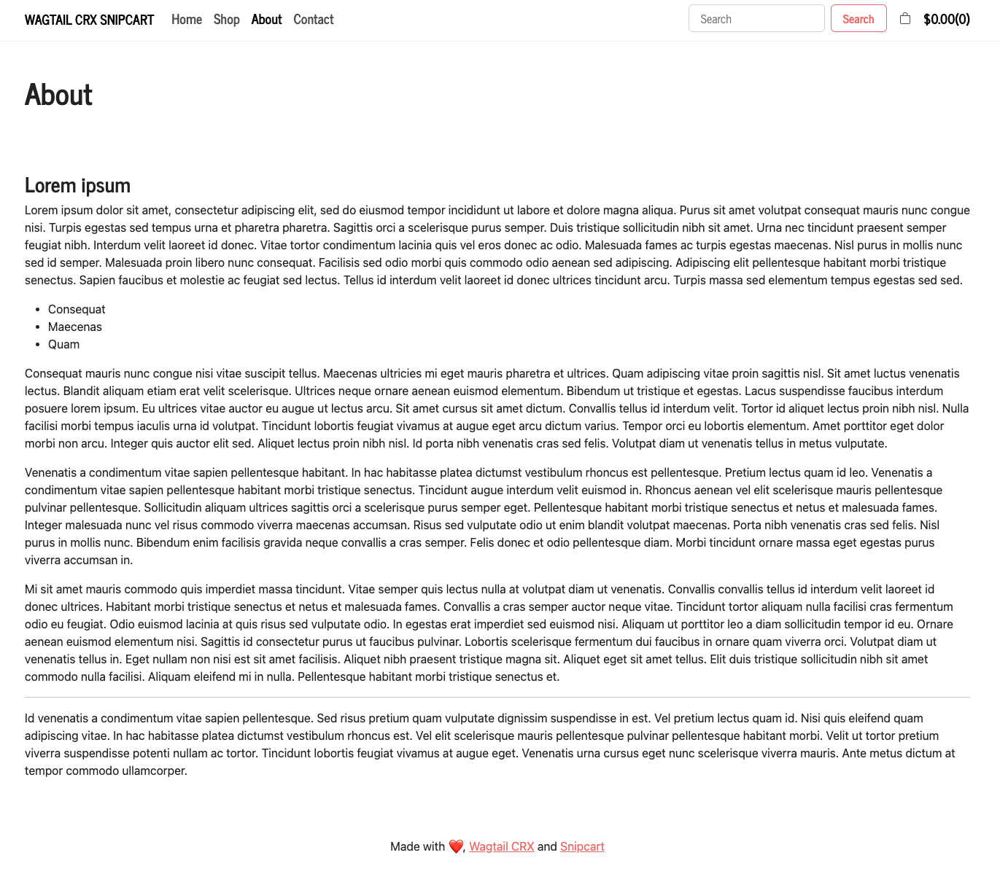
11. 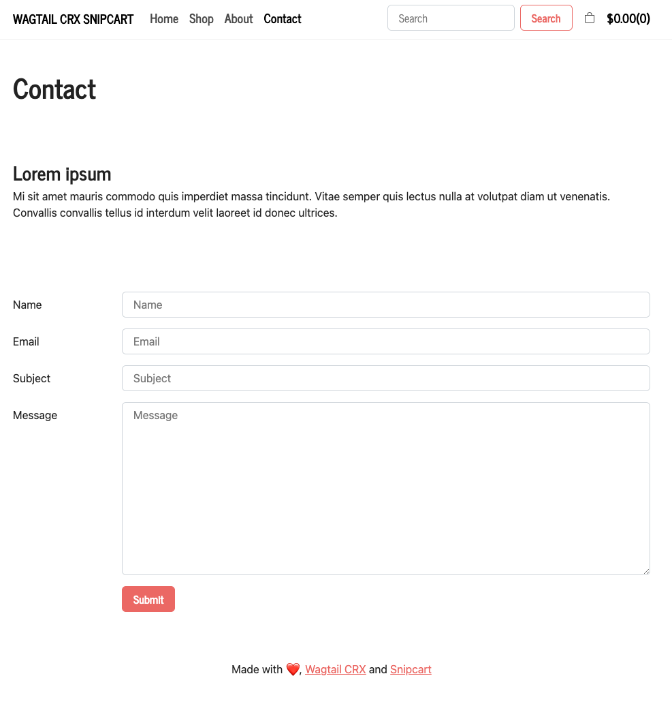

##### Note
I did not share screenshots of the admin as it should be straightforward with a combination of the official Wagtail CRX and Wagtail documentation alongside this README.

## Bugs
None currently known.

## Room for Improvement
1. Add tests for newly developed features.
   - Goal: Implement TDD for future development.
2. Make feature that allows end user to elect to have the snipcart shopping cart panels reflect websites styling.

## Recommended Hosting Solution
[CodeRed Cloud](https://www.codered.cloud/)

## Giving Credit

Credit is given to the following:
 1. [CodeRed](https://www.coderedcorp.com/) - for developing and maintaining [Wagtail CRX](https://docs.coderedcorp.com/wagtail-crx/)
 2. [Paul Wababu](https://github.com/paulwababu) - for creating a wonderful [Wagtail and Snipcart integration lesson](https://dev.to/paulwababu/build-an-e-commerce-site-with-wagtail-cms-bootstrap-django-framework-4jdb) I leveraged massively 
 3. The [Django](https://www.djangoproject.com/) and [Wagtail](https://wagtail.org/) communities - for providing such thorough documentation
 4. [Stack Overflow](https://stackoverflow.com/) - for when I wasn't wise enough to read the documentation.

## Contact

If you're interested in working with me to improve this project, feel free to contact me on my [website](https://www.justicedouglas.com/). Alternatively, I would love to hear any questions, comments, or feedback you may have.

## Attribution
Files in `wagtail_crx_snipcart_storefront/website/models.py `, `wagtail_crx_snipcart_storefront/website/templates/coderedcms`, `wagtail_crx_snipcart_storefront/mysite/settings/base.py`:
- Were sourced from the Wagtail CRX project at
  https://github.com/coderedcorp/coderedcms.
- Are licensed under the Creative Commons Attribution 3.0 Unported
  license, a copy of which is available at
  https://creativecommons.org/licenses/by/3.0/
- Have been modified from the original sources.

I created all examples images, such as home page cover photos and products, using [Midjourney](https://www.midjourney.com/home/). The [commercial terms](https://midjourney.gitbook.io/docs/billing#commercial-terms) that apply to me regarding Midjourney also apply to you if you utilize these images for any purpose other than viewing this README.

---

Made with ♥ using [Wagtail CRX](https://www.coderedcorp.com/cms/) + [Snipcart](https://snipcart.com/)